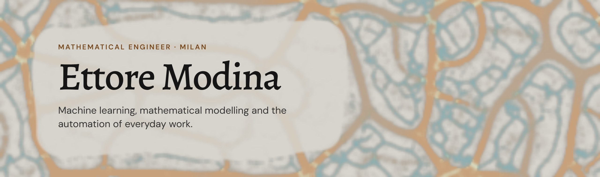
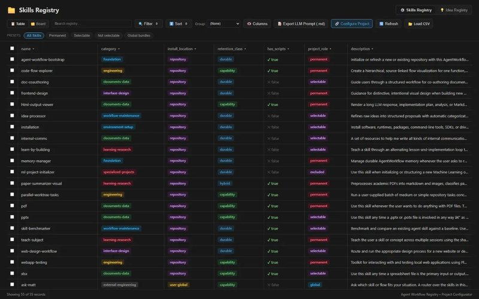
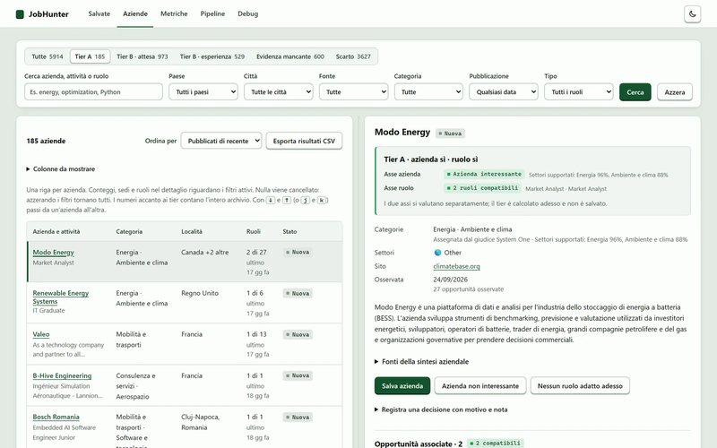
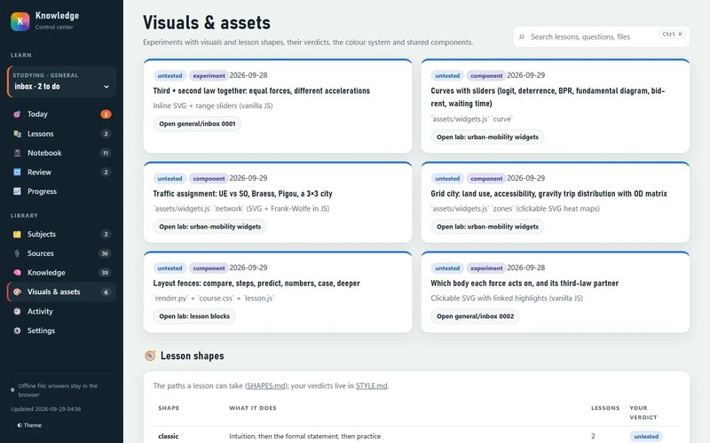
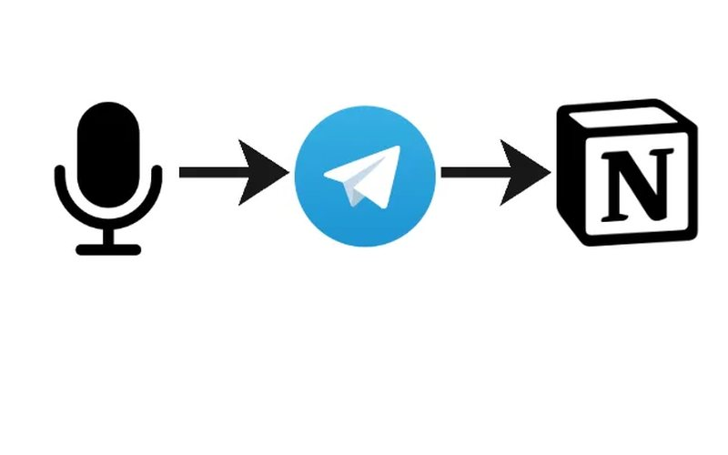
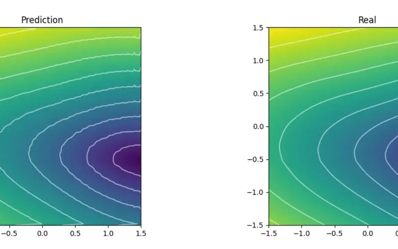
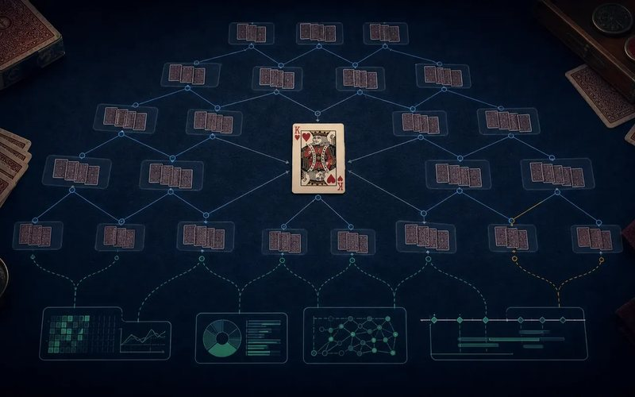
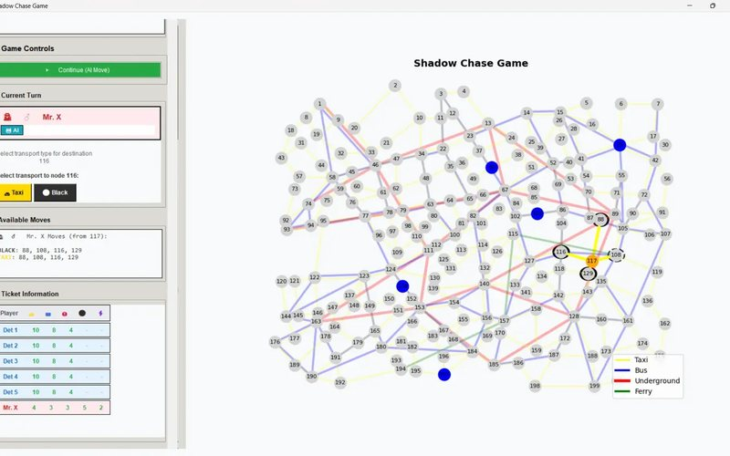
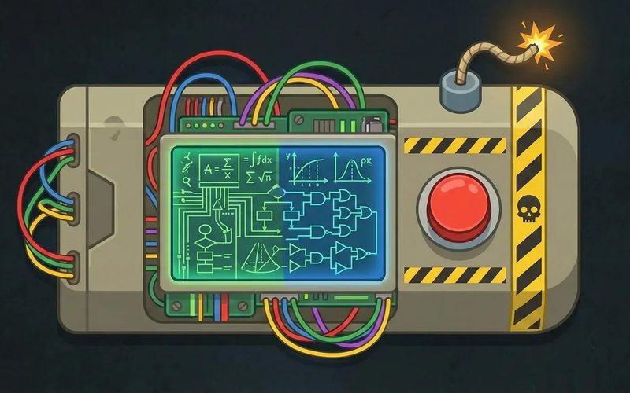
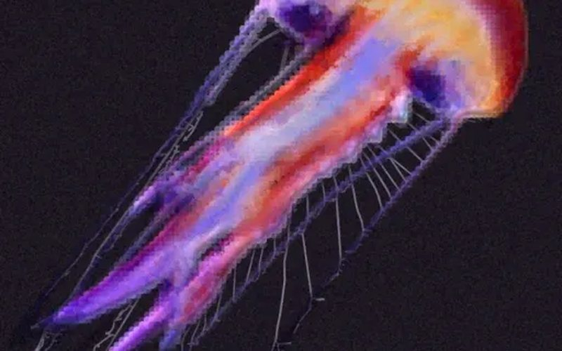

<a href="https://ettoremodina-webportfolio.netlify.app">
  <picture>
    <source media="(prefers-color-scheme: dark)" srcset="assets/banner-dark.jpg">
    
  </picture>
</a>

The background is the <i>Physarum</i> simulation that runs on my portfolio's home page · <a href="https://ettoremodina-webportfolio.netlify.app/projects/portfolio-animations">how it works</a>

I'm a mathematical engineer (M.Sc., Politecnico di Milano) working as a Technical Data Analyst at SDG in Milan. I like problems that take a while to understand: I study the mathematics first, then build the smallest model or tool that solves them. When I follow a procedure, I end up asking which steps I could automate, and most of my recent projects started that way.

  <b><a href="https://ettoremodina-webportfolio.netlify.app">Portfolio</a></b> &nbsp;·&nbsp;
  <a href="https://www.linkedin.com/in/ettore-modina-b189881a9/">LinkedIn</a> &nbsp;·&nbsp;
  <a href="mailto:modinaettore@outlook.it">modinaettore@outlook.it</a>

## Recent work: automation and agent tooling

Tools I built to take repeated work off my hands, most of them around coding agents and local models.

<table>
  <tr>
    <td width="50%" valign="top">
      
      <h3>Agent Workflow</h3>
      Shared instructions, skills and project memory for the coding agents I use across my projects, so a procedure set up once is available in every repository.
        
      <a href="https://ettoremodina-webportfolio.netlify.app/projects/agent-workflow"><b>Write-up</b></a>
    </td>
    <td width="50%" valign="top">
      
      <h3>JobHunter</h3>
      Collects job ads, screens them against my profile in stages ordered by cost (rules, a typed model, my own review) and summarises the roles that pass.
        
      <a href="https://ettoremodina-webportfolio.netlify.app/projects/jobhunter"><b>Write-up</b></a> · <a href="https://github.com/ettoremodina/JobHunter">Code</a>
    </td>
  </tr>
  <tr>
    <td width="50%" valign="top">
      
      <h3>Learning Library</h3>
      A personal learning library where questions become saved lessons written by an agent, and my feedback shapes how the next one is taught.
        
      <a href="https://ettoremodina-webportfolio.netlify.app/projects/knowledge"><b>Write-up</b></a> · <a href="https://github.com/ettoremodina/Knowledge-public">Code</a>
    </td>
    <td width="50%" valign="top">
      
      <h3>Voice Expense Tracker</h3>
      A prototype that turns Telegram voice messages into expense entries, with local transcription and extraction and a confirmation before saving to Notion.
        
      <a href="https://ettoremodina-webportfolio.netlify.app/projects/voice-expense-tracker"><b>Write-up</b></a>
    </td>
  </tr>
</table>

The same thread runs through my job: at SDG I develop dbt models for stock and supply-chain analysis and automate manual checks for operational teams, such as a Cloud Function that detects inconsistencies in daily data and a script that diagnoses pipeline errors across workflows.

## Modelling and machine learning

<table>
  <tr>
    <td width="33%" valign="top">
      
      <b>Hybrid Digital Twin of a Satellite Thermal System</b> 
      Master's thesis with Thales Alenia Space: an LSTM that estimates the parameters of a satellite thermal model.
        
      <a href="https://ettoremodina-webportfolio.netlify.app/projects/digital-twin-satellite">Write-up</a>
    </td>
    <td width="33%" valign="top">
      
      <b>Physics-Informed ML for Inverse Problems</b> 
      Three inverse problems in which physical knowledge constrains what can be inferred from sparse observations.
        
      <a href="https://ettoremodina-webportfolio.netlify.app/projects/physics-informed-ml">Write-up</a>
    </td>
    <td width="33%" valign="top">
      
      <b>Regicide: Search Under Uncertainty</b> 
      An AI player for the card game Regicide, built to compare ways of deciding with incomplete information.
        
      <a href="https://ettoremodina-webportfolio.netlify.app/projects/regicide-ai">Write-up</a> · <a href="https://github.com/ettoremodina/RegicideRL">Code</a>
    </td>
  </tr>
  <tr>
    <td width="33%" valign="top">
      
      <b>Learning to Play Scotland Yard</b> 
      My first experiments with reinforcement learning, for the two sides of the Scotland Yard pursuit game.
        
      <a href="https://ettoremodina-webportfolio.netlify.app/projects/rl-scotland-yard">Write-up</a> · <a href="https://github.com/ettoremodina/ShadowChase">Code</a>
    </td>
    <td width="33%" valign="top">
      
      <b>Bomb Buster</b> 
      A deduction assistant that tracks the possible hidden states and suggests moves by expected information gain.
        
      <a href="https://ettoremodina-webportfolio.netlify.app/projects/bomb-buster">Write-up</a> · <a href="https://github.com/ettoremodina/BombBuster">Code</a>
    </td>
    <td width="33%" valign="top">
      
      <b>Biomorphic Animations</b> 
      An ongoing project that turns images into growing animations with algorithms inspired by biological processes.
        
      <a href="https://ettoremodina-webportfolio.netlify.app/projects/neural-organic-growth">Write-up</a> · <a href="https://github.com/ettoremodina/InverseImage">Code</a>
    </td>
  </tr>
</table>

<b><a href="https://ettoremodina-webportfolio.netlify.app/projects">All projects, each with a full write-up →</a></b>

## Activity

<picture>
  <source media="(prefers-color-scheme: dark)" srcset="https://raw.githubusercontent.com/ettoremodina/ettoremodina/output/contributions-dark.svg">
  
</picture>

## Background

<table>
  <tr><td width="150"><b>2026&nbsp;–&nbsp;now</b></td><td>Technical Data Analyst, SDG, Milan</td></tr>
  <tr><td><b>2024&nbsp;–&nbsp;2025</b></td><td>Master's thesis intern, Thales Alenia Space Italia</td></tr>
  <tr><td><b>2024</b></td><td>LLM evaluation intern, Indigo.ai: an automated framework to compare language models on response quality and token cost</td></tr>
  <tr><td><b>2022&nbsp;–&nbsp;2025</b></td><td>M.Sc. Mathematical Engineering, Politecnico di Milano</td></tr>
  <tr><td><b>2019&nbsp;–&nbsp;2022</b></td><td>B.Sc. Mathematical Engineering, Politecnico di Milano</td></tr>
</table>

The full timeline is on the [About page](https://ettoremodina-webportfolio.netlify.app/about).

## Tools

<table>
  <tr><td><b>Languages</b></td><td>Python · R · SQL · C++</td></tr>
  <tr><td><b>Machine&nbsp;learning</b></td><td>PyTorch · TensorFlow · scikit-learn · NumPy · Optuna</td></tr>
  <tr><td><b>Data&nbsp;engineering</b></td><td>dbt · BigQuery · Terraform · Git</td></tr>
  <tr><td><b>LLM&nbsp;systems</b></td><td>LLM evaluation · agent harnesses · LangChain · Ollama</td></tr>
</table>

## Contact

I'd be glad to hear about work in data science or mathematical modelling: [modinaettore@outlook.it](mailto:modinaettore@outlook.it), [LinkedIn](https://www.linkedin.com/in/ettore-modina-b189881a9/), or the [contact form](https://ettoremodina-webportfolio.netlify.app/contact) on the portfolio.
